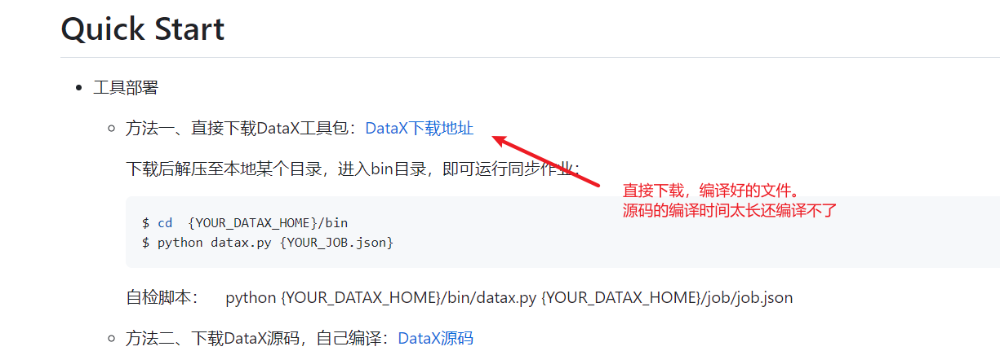
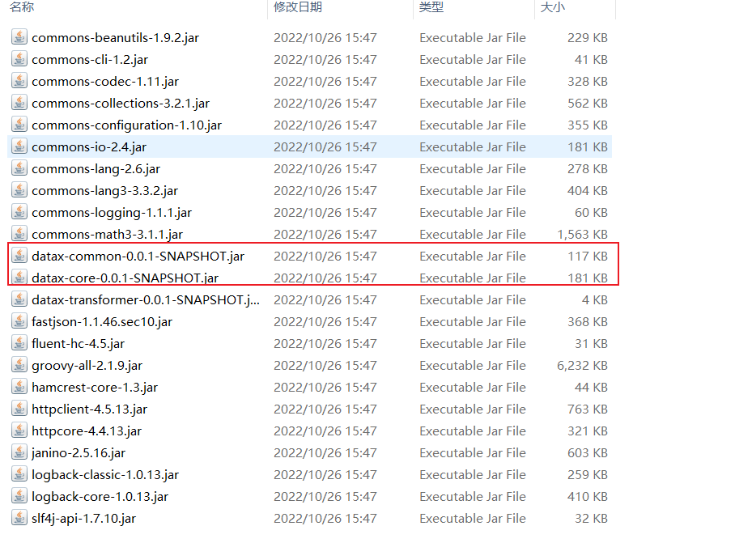
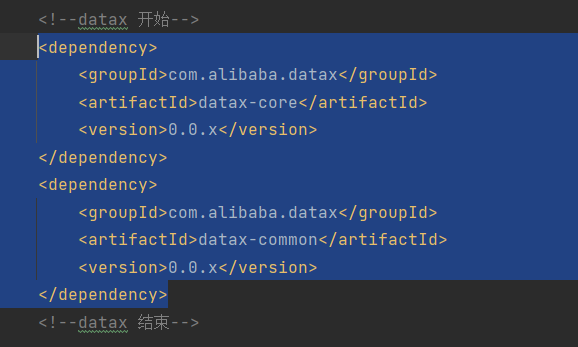
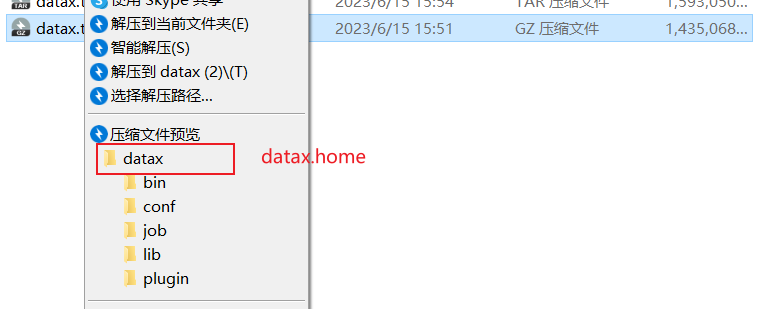

## springboot集成datax,json文件远端存储实现的demo 

## 脚本见doc

## 环境准备
### 1、下载datax编译好的包 

https://github.com/alibaba/DataX/blob/master/userGuid.md
### 2、解压下载的文件，将lib包的datax-common-0.0.1-SNAPSHOT和datax-core-0.0.1-SNAPSHOT安装到本地

### 3、引入datax-common-0.0.1-SNAPSHOT和datax-core-0.0.1-SNAPSHOT的依赖

### 4、配置datax.home的目录（下载的编译文件解压后的目录）,非常重要！！！执行数据同步任务的时候会根据datax.home去该目录下找对应的执行命令和执行插件

